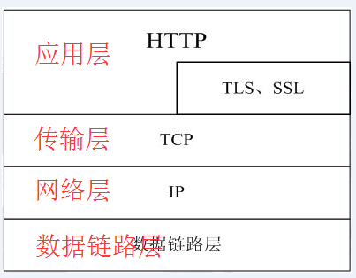

网络 socket编程

HTTP协议工作在TCP/IP协议族的应用层，传输层使用的TCP，结构大概就是这个样子的





最简单的http服务器能实现如下功能即可：  
* 1，使用socket，监听某端口（比如80）
* 2，收到请求header，解析header中的地址
* 3，按地址取资源（可以理解为就是文件），生成响应header，把文件内容加在生成的响应header中返回

采用Socket实现，添加了域名解析的功能
```commandline

package com.example;

import java.io.ByteArrayOutputStream;
import java.io.InputStream;
import java.io.OutputStreamWriter;
import java.net.InetAddress;
import java.net.Socket;
import java.net.UnknownHostException;

public class MyHttpClient {

    public static class HTTPAddress {
        String hostAddress;
        int point = 80;

        public HTTPAddress(String hostAddress, int point) {
            this.hostAddress = hostAddress;
            this.point = point;
        }

    }

    public static void main(String[] args) {
        String url = "http://blog.csdn.net/qq_22706515/article/details/51819472";
        getStringByUrl(url);


    }

    public static final String HTTP_HEAD = "http://";

    public static HTTPAddress getHTTPAddress(String url) {
        if (url == null || url.equals("")) {
            return null;
        }
        String head = "";
        //默认端口80
        int point = 80;
        if (url.startsWith(HTTP_HEAD)) {
            url = url.substring(HTTP_HEAD.length());
        }
        //获取域名部分
        head = url.split("/")[0];
        //如果在url中指定端口，则获取端口
        int index = head.indexOf(":");
        if (index != -1) {
            String pointStr = head.substring(index + 1).trim();
            head = head.substring(0, index);
            point = Integer.valueOf(pointStr);
        }
        try {
            //更具域名获取ip地址
            String hostAddress = InetAddress.getByName(head).getHostAddress();
            HTTPAddress httpAddress = new HTTPAddress(hostAddress, point);
            return httpAddress;
        } catch (UnknownHostException e) {
            e.printStackTrace();
        }
        return null;
    }


    public static void getStringByUrl(String url) {
        try {
            HTTPAddress httpAddress = getHTTPAddress(url);
            if (httpAddress == null) {
                return;
            }
            Socket socket = new Socket(httpAddress.hostAddress, httpAddress.point);
            OutputStreamWriter osw = new OutputStreamWriter(socket.getOutputStream());
            StringBuffer sb = new StringBuffer();
            //拼装请求头，注意最后需要用\r\n结尾
            sb.append("GET " + url + " HTTP/1.1\r\n");
            sb.append("Host: " + httpAddress.hostAddress + ":" + httpAddress.point + "\r\n");
            sb.append("Connection: keep-alive\r\n");
            //最后的\r\n不可省略表示报文首部与报文主体的分隔
            sb.append("\r\n");
            osw.write(sb.toString());
            osw.flush();
            InputStream is = socket.getInputStream();
            int count = 0;
            byte[] b = new byte[8192];
            ByteArrayOutputStream baos = new ByteArrayOutputStream();
            while ((count = is.read(b)) != -1) {
                baos.write(b, 0, count);
            }
            is.close();
            baos.close();
            String result = baos.toString();
            //根据空行，分隔出报文首部，与报文主体
            String separateStr="\r\n\r\n";
            int index = result.indexOf(separateStr);
            String headStr = result.substring(0, index);
            String contentStr=result.substring(index+separateStr.length());
            System.out.print("head:"+headStr+"\n");
            System.out.print("content:"+contentStr+"\n");
        } catch (Exception e) {
            e.printStackTrace();
        }
    }


}
```


参考文献
* [自己实现HTTP协议](https://blog.csdn.net/qq_22706515/article/details/51838622)
* [Java实现的http协议方式](http://ytluck.github.io/program/my-program-post-03.html)
