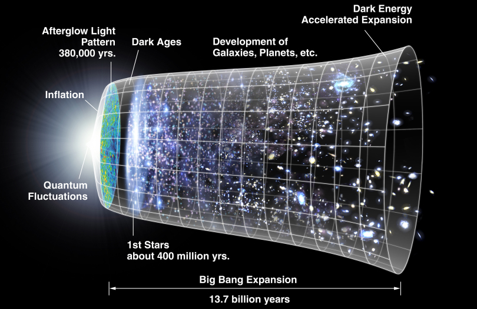
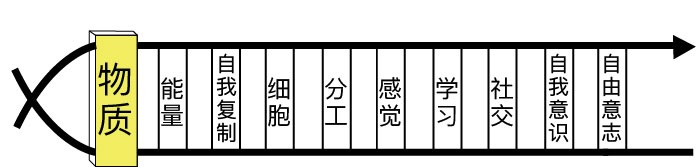

## shidexiao的博客
>博客的目的主要是为了作为个人学习笔记，方便查看复习，不过尽量写的通俗移动，希望可以帮到部分像我一样零基础自学的人，
如有错误，欢迎拍砖

## linux命令

目录

* linux命令  
    [opt_arg](./linux_command/opt_arg.md)
    * 文件管理类
        * [ln](./linux_command/ln.md)
    * 磁盘管理
        * [ls](./linux_command/ls.md)
    * 文档编辑
        * [grep](./linux_command/grep.md)
     
* 版本管理

    [github]()
    
* 从零开始系列

    * 

* 物理学
    * 相对论与电磁学系列 (余海峰David | 物理喵phycat)
        * [你也能懂相对论](https://hfdavidyu.com/2015/03/27/%E4%BD%A0%E4%B9%9F%E8%83%BD%E6%87%82%E7%9B%B8%E5%B0%8D%E8%AB%96/)
        * [光的秘密](https://hfdavidyu.com/2015/03/29/%E5%85%89%E7%9A%84%E7%A5%95%E5%AF%86/)
        * [照亮相对论的光(上)](https://hfdavidyu.com/2015/04/01/%E7%85%A7%E4%BA%AE%E7%9B%B8%E5%B0%8D%E8%AB%96%E7%9A%84%E5%85%89-%E4%B8%8A/)
        * [照亮相对论的光(下)](https://hfdavidyu.com/2015/04/05/%E7%85%A7%E4%BA%AE%E7%9B%B8%E5%B0%8D%E8%AB%96%E7%9A%84%E5%85%89-%E4%B8%8B/)
    * 量子物理
        * [你也能懂量子力学 ](https://hfdavidyu.com/2015/06/05/%E4%BD%A0%E4%B9%9F%E8%83%BD%E6%87%82%E9%87%8F%E5%AD%90%E5%8A%9B%E5%AD%B8/)

* 生物学

